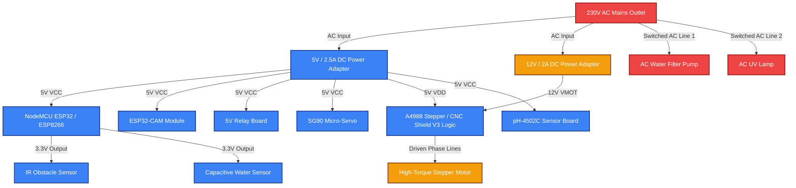

# Master Parts List & Hardware Interfacing Diagrams

This document contains the detailed Bill of Materials (BOM), specifications, pin mapping reference, and system connection schematics for the **Smart Aqua Manage Bot (v2.0)**.

---

## 📊 System Connection & Signal Flow Diagrams

### 1. Power Distribution Schema
To ensure electrical safety and clean logic signals, the system splits power between low-voltage DC lines and switched high-voltage AC lines. High-torque stepper driving utilizes an external power source to avoid electrical noise interfering with the sensors.

### 2. Wiring & Pin Interfacing Diagram
Below is the wiring diagram demonstrating how sensor outputs route to the input pins of the NodeMCU, and how output pins drive relays and motor controllers (or via the alternative CNC Shield V3 interface). The ESP32-CAM operates independently on the local network, broadcasting the video stream over Wi-Fi.

```mermaid
graph TD
    %% Core Controllers
    subgraph Core Controller [NodeMCU ESP32 / ESP8266]
        MCU[Microcontroller CPU]
        Pin_D1[GPIO D1 / Step]
        Pin_D2[GPIO D2 / Dir]
        Pin_D3[GPIO D3 / Servo PWM]
        Pin_D4[GPIO D4 / Relay 1]
        Pin_D5[GPIO D5 / Relay 2]
        Pin_D6[GPIO D6 / IR Signal]
        Pin_D7[GPIO D7 / Water Level]
        Pin_D8[GPIO D8 / IR Enable]
        Pin_A0[Analog A0 / pH Read]
    end

    subgraph Secondary Module [ESP32-CAM]
        CAM_Module[ESP32 Camera CPU]
        OV2640[OV2640 Camera Lens]
    end

    %% Sensor Inputs
    subgraph Input Sensors
        IR[KY-032 IR Sensor]
        Capacitive[Capacitive Water Sensor]
        pH[pH-4502C Sensor Board]
    end

    %% Output Actuators
    subgraph Output Actuators
        A4988["A4988 Driver (or CNC Shield V3 X-Axis)"]
        Servo[SG90 Micro-Servo]
        Relays[5V Dual-Channel Relay Board]
    end

    %% Wiring Connections
    IR -->|Digital Out| Pin_D6
    Pin_D8 -.->|Optional Enable Signal| IR
    Capacitive -->|Digital Out| Pin_D7
    pH -->|Analog Voltage Out| Pin_A0

    Pin_D1 -->|Step Pulses| A4988
    Pin_D2 -->|Direction Signal| A4988
    Pin_D3 -->|PWM Control| Servo
    Pin_D4 -->|Trigger Channel 1| Relays
    Pin_D5 -->|Trigger Channel 2| Relays

    OV2640 -->|Internal Bus| CAM_Module

    %% Wireless communication
    CAM_Module -.->|Local Wi-Fi Network| MCU
```

---

## 📋 Master Bill of Materials (BOM)

### 🧠 1. Core Controllers & Power
| Part Image / Symbol | Component Name | Key Specifications | Primary Role in System | Qty |
| :---: | :--- | :--- | :--- | :---: |
| 🎛️ | **NodeMCU Microcontroller** | ESP32 or ESP8266, 2.4GHz Wi-Fi, Micro-USB port, SPI/I2C/GPIO. | Executes primary control loops, scheduling, sensor parsing, and drives the WebSockets/HTTP server. | 1 |
| 📷 | **ESP32-CAM Module** | OV2640 camera sensor, built-in flash LED, MicroSD slot, local IP streaming. | Captures video frames of aquatic life and serves a local HTTP MJPEG video stream directly to the web dashboard. | 1 |
| 🔌 | **5V DC 2.5A Power Adapter** | Input: 100-240V AC; Output: 5V DC, Micro-USB or bare terminal wires. | Provides regulated logic power to the NodeMCU, ESP32-CAM, servo, and relay boards. | 1 |
| 🔌 | **12V DC 2A Power Supply** | Output: 12V DC, Wall-wart adapter or switching terminal power block. | Supplies dedicated high-current driving voltage to the stepper motor driver (VMOT input). | 1 |

### 🔌 2. Switching & Motor Drivers
| Part Image / Symbol | Component Name | Key Specifications | Primary Role in System | Qty |
| :---: | :--- | :--- | :--- | :---: |
| ⚡ | **5V Relay Board** | 2-Channel, Opto-isolated, Songle SRD-05VDC-SL-C relays, load capacity 10A @ 250V AC. | Opto-isolates and switches mains AC power lines running the filter pump and UV sterilizer. | 1 |
| 🛹 | **Stepper Motor Driver Breakout** | A4988 chip, adjustable current limiting, over-temperature thermal shutdown, 5 microstep resolutions. | Interfaces NodeMCU step/direction pulses to regulate phase currents flowing to the stepper motor. | 1 |
| 🛹 | **CNC Shield V3 (Alternative)** | Multi-axis Arduino Uno Shield, houses A4988 drivers, built-in filter capacitors, reset/sleep jumpers, 12-36V input. | Alternative to breakout board; simplifies stepper wiring, power decoupling, and microstepping settings. | 1 |

### 🧲 3. Actuators & Mechanical Components
| Part Image / Symbol | Component Name | Key Specifications | Primary Role in System | Qty |
| :---: | :--- | :--- | :--- | :---: |
| ⚙️ | **SG90 Micro-Servo Motor** | Operating torque: 1.8 kg-cm @ 4.8V, 180-degree rotation limit. | Rotates the feeder drum/gate to dispense dry food flakes during scheduled or manual cycles. | 1 |
| 🏎️ | **Stepper Motor (NEMA 17)** | Model: 17HS4023 "Pancake", 42x42x23mm, D-Shaft (5mm), 1.8° step angle, 0.7A-1.0A current rating. | Drives the timing belt/pulley assembly to sweep the magnetic glass scraper horizontally across the tank front. | 1 |
| 🔧 | **Mechanical Mounting Kit** | GT2 Timing Belt (2m), GT2 Pulleys (20 teeth, 5mm bore), floating feeding ring, acrylic mounts. | Provides the structural brackets, pulleys, and tracks to physically build the scraper drive and feeding ring. | 1 |

### 📡 4. Sensors & Water Quality Tools
| Part Image / Symbol | Component Name | Key Specifications | Primary Role in System | Qty |
| :---: | :--- | :--- | :--- | :---: |
| 🚨 | **KY-032 IR Sensor** | 38kHz modulated frequency, NE555 timer, active-low digital output, range 2-40cm, enable pin. | Mounted above the floating feeding ring; detects leftover floating food while ignoring ambient light reflections. | 1 |
| 🧪 | **Analog pH Sensor (pH-4502C)** | Detection range pH 0-14, operating temperature 0-60°C, response time <1 min, calibration trimpots. | Submersed probe that outputs analog voltages proportional to the pH level to report aquarium water acidity. | 1 |
| 💧 | **Capacitive Water Sensor** | Contactless capacitive level switch, liquid level detection thickness up to 10mm. | Fixed externally on the tank wall at the critical low-level mark to trigger emergency alarms. | 1 |

---

## 📌 Pin Interfacing Quick-Reference Table

| NodeMCU Pin | Component | Component Pin / Wire | Connection Type | Description |
| :--- | :--- | :--- | :--- | :--- |
| **5V / Vin** | All 5V Boards | VCC / 5V / VDD | Power | 5V Logic voltage supply line |
| **GND** | All Components | GND | Ground | Common system ground reference |
| **D1 (GPIO 5)** | A4988 Driver / CNC Shield V3 | STEP / X.STEP pin | Digital Output | High/Low pulses to drive stepper distance and speed |
| **D2 (GPIO 4)** | A4988 Driver / CNC Shield V3 | DIR / X.DIR pin | Digital Output | High (Forward) / Low (Reverse) direction control |
| **D3 (GPIO 0)** | SG90 Servo | Signal (Orange) | PWM Output | Servo angle positioning signal (0 to 180 degrees) |
| **D4 (GPIO 2)** | 5V Relay Ch 1 | IN1 (Filter Pump) | Digital Output | Active-Low signal triggering primary filter pump relay |
| **D5 (GPIO 14)**| 5V Relay Ch 2 | IN2 (UV Light) | Digital Output | Active-Low signal triggering germicidal UV lamp relay |
| **D6 (GPIO 12)**| KY-032 IR Sensor | OUT | Digital Input | High (Clear) / Low (Leftover food detected) |
| **D7 (GPIO 13)**| Capacitive Sensor| OUT (Water Level) | Digital Input | High (Water Present) / Low (Water Below Level - Alarm) |
| **D8 (GPIO 15)**| KY-032 IR Sensor | EN (Optional) | Digital Output | Low (Enable) / High (Disable). Leave jumper cap on to bypass. |
| **A0 (ADC 0)**  | pH-4502C Board | PO (pH Output) | Analog Input | Voltage signal representation of water acidity level |

---

> [!NOTE]
> **CNC Shield V3 Wiring Details:**
> If you choose to use the CNC Shield V3 instead of the standalone A4988 breakout board:
> 1. Use the **X-axis** driver slot on the shield for the stepper motor.
> 2. Bridge the **Reset** and **Sleep** pins on the X-axis driver slot using a jumper cap.
> 3. Connect NodeMCU D1 (GPIO 5) directly to the **X.STEP** header pin (corresponding to Arduino Uno D2 pin).
> 4. Connect NodeMCU D2 (GPIO 4) directly to the **X.DIR** header pin (corresponding to Arduino Uno D5 pin).
> 5. Wire NodeMCU 5V (Vin) to the shield's 5V input header, and NodeMCU GND to one of the shield's GND pins.
> 6. Wire the external 12V power supply directly to the blue screw terminals on the CNC Shield.

> [!IMPORTANT]
> **Stepper Motor Current Limit (\(V_{ref}\)) Tuning:**
> Since the slim **17HS4023** stepper motor is rated for lower current (\(0.7\text{A} - 1.0\text{A}\)) than a standard NEMA 17, you **must** limit the driver's output current to prevent the motor from overheating:
> 1. **Current Limit Target:** Limit the target output current to **\(0.6\text{A} - 0.7\text{A}\)** for optimal, cool operation.
> 2. **Calculate \(V_{ref}\):** For standard A4988 drivers with \(0.1\,\Omega\) sensing resistors:
>    \[
>    V_{ref} = I_{limit} \times 8 \times R_{sense} \approx 0.7\text{ A} \times 8 \times 0.1 = 0.56\text{ V}
>    \]
> 3. **Hardware Tuning:** Connect your multimeter between the A4988 driver's screw potentiometer (positive probe) and the system Ground (negative probe). Slowly turn the potentiometer using a small screwdriver until it reads **`0.48V - 0.56V`**.
