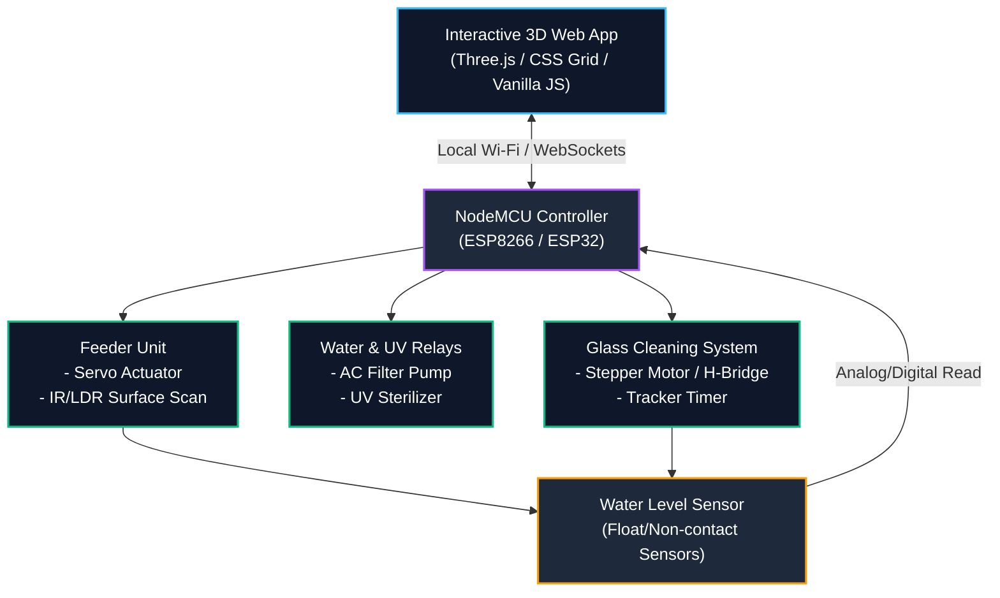

# Smart Aqua Manage Bot

An advanced, decentralized, and standalone aquarium management ecosystem powered by local microcontrollers, physical sensors, and a real-time responsive 3D web interface. 

By prioritizing high-reliability local hardware loops over complex cloud networks, this system ensures zero-latency task execution, maximum safety fail-safes, and a fully automated maintenance schedule—including an innovative motorized glass-cleaning system.

---

## 🛠️ System Component Architecture

The Smart Aqua Manage Bot operates completely offline on a standalone localized loop. The architecture is split between a local 3D web interface dashboard and a dedicated microcontroller managing the sensor-actuator loops.



### Logical Overview
```
                       +-----------------------------+
                       |   Interactive 3D Web App    |
                       |    (Three.js / Vanilla CSS) |
                       +--------------+--------------+
                                      |
                                      | Local Wi-Fi / WebSockets
                                      v
                       +-----------------------------+
                       |      NodeMCU Controller     |
                       |       (ESP8266/ESP32)       |
                       +--------------+--------------+
                                      |
         +----------------------------+----------------------------+
         |                            |                            |
         v                            v                            v
+------------------+         +------------------+         +------------------+
|   Feeder Unit    |         | Water & UV Relays|         | Glass Cleaning   |
| - Servo Actuator |         | - AC Filter Pump |         | - Stepper Motor  |
| - IR Surface Scan|         | - UV Sterilizer  |         | - Tracker Timer  |
+------------------+         +------------------+         +------------------+
         |                                                         |
         +-------------------> [Water Level Sensor] <--------------+
```

---

## 📋 System Functions Matrix

### 🥖 1. Feeding & Automation Functions
* **6-Hour Scheduled Feeding Loop:** A local internal timer automatically triggers a physical feeding routine every 6 hours.
* **Local Surface Barrier Scan:** Prior to dropping food, the system scans the surface zone utilizing an Infrared (IR) beam or Light-Dependent Resistor (LDR) barrier mounted inside a floating feeding ring.
* **Intelligent Skip Override:** If the surface scan detects leftover floating food, the upcoming scheduled feeding cycle is immediately aborted to prevent hazardous overfeeding and organic water decay.
* **Monospace Countdown Telemetry:** Calculates and displays a precise numerical countdown ($hh:mm:ss$) on the web dashboard showing the remaining time until the next automatic feed.
* **Physical Feed Override Button:** A dedicated dashboard switch that triggers the feeding servo immediately, completely bypassing the surface sensor check.

### 🎛️ 2. Water Filtration & UV Control Functions
* **Filter Pump Toggle Switch:** An instantaneous mechanical switch in the Web UI to engage or cut power to the primary AC water filtration pump relay.
* **UV Sterilizer Toggle Switch:** An independent control switch on the dashboard to activate or deactivate the germicidal Ultraviolet light bulb to control algae spores and clear turbidity.

### 🚨 3. Safety & Monitoring Functions
* **Critical Water Level Monitoring:** Active, continuous tracking of the aquarium's volume via physical float switches or non-contact liquid level sensors.
* **Direct Emergency Routing:** If the water level drops below the designated threshold, critical alarm indicators immediately override the web interface, routing real-time warnings directly to localized alert logs.

### 🧼 4. Automated Glass Cleaning Functions
* **Accumulated Run-Time Tracker:** Logs the cumulative running hours of the UV light and ambient lighting systems, which directly correlate to predicted algae accumulation rates.
* **Glass Condition Estimation Logic:** Every $168\text{ hours}$ (7 days) of total lighting runtime, the system flags the aquarium glass panel as degraded or "dirty."
* **Automated Cleaning Cycle Activation:** The NodeMCU automatically triggers a high-torque continuous servo or stepper motor drive system, moving a magnetic glass-scraper carriage horizontally back and forth across the front pane.
* **Web UI Glass Maintenance Alert:** Pushes an amber status card reading *"Automated Glass Cleaning in Progress"* to the web timeline and applies a green, cloudy texture layer over the 3D tank interface model during active sweeps.
* **Manual Reset & Run Switch:** Provides a dashboard control button to force an instant glass cleaning cycle on demand and reset the accumulated run-time tracker back to zero.

---

## 🔌 Hardware Setup & Interfacing (Conceptual)

To achieve maximum isolation and electrical protection for aquatic systems, the architecture utilizes a decentralized, opto-isolated wiring topology:

| Component | Functionality & Connection | Purpose |
| :--- | :--- | :--- |
| **Digital Relay Board** | Connects NodeMCU digital pins through optoisolators to high-voltage AC switches. | Isolates low-voltage electronics from high-voltage AC utility lines running the filtration pumps and UV ballasts. |
| **Motor Driver Module** | Employs an H-bridge driver (e.g., A4988 or L298N) to control the high-torque stepper/servo drive belt. | Drives the magnetic scraper carriage smoothly and reliably along the front pane. |
| **Fail-Safe Circuitry** | Sensors default to high-impedance closed states. | Ensures that if a cable is severed or disconnected, the system fails closed and triggers an immediate emergency warning. |

---

## 🎨 Web App Layout & UI Specs

The frontend interface is a unified, fully responsive single-page dashboard divided into three balanced interactive panels:

```
+-----------------------------------------------------------------------------+
|                            SMART AQUA MANAGE BOT                            |
+--------------------------+--------------------------+-----------------------+
|  Panel 1: Control Center | Panel 2: Live View & Commands | Panel 3: Status Log  |
|                          |                          |                       |
|   [ 3D Viewport ]        |   Telemetry:             |  Timeline:            |
|   * Water Level Y-Scale  |   - Next Feed: 05:42:10  |  [Cyan] Filter ON     |
|   * UV violet ambient glow|                         |                       |
|   * Particle bubbles     |   Switches:              |  [Amber] Feed Skipped |
|   * Green cloudy texture |   [Filter]  [UV Light]   |                       |
|                          |   [Feed]    [Clean Glass]|  [Red] LOW WATER!     |
+--------------------------+--------------------------+-----------------------+
```

### 🎛️ Panel 1: Control Center (3D Viewport)
An interactive, low-poly 3D render of the aquarium tank powered by **Three.js** that reacts dynamically to physical telemetry updates:
* **Water Level:** Scales its $Y$-axis mesh programmatically based on the water level sensor status.
* **UV Active:** Fades in a glowing violet interior ambient light when the UV light is toggled.
* **Active Filtration:** Emits a vertical stream of particle bubbles when the filter pump runs.
* **Dirty Glass:** Gradually renders a green-tinted cloudy texture over the glass panel mesh as the run-time clock increases.

### 📊 Panel 2: Live View & Manual Commands
Displays direct telemetry data from the local sensors and features sleek, modern switches with custom animation transitions:
* **Telemetry Display:** Shows physical water level status, cumulative run-time logs, and a monospace countdown timer ($hh:mm:ss$) for the next feed.
* **Filter Unit Switch:** Toggles the state of the primary AC filtration pump relay.
* **UV Light Switch:** Toggles the germicidal UV sterilizer bulb.
* **Manual Feeding Override:** Instantly activates the feeding servo, bypassing sensor checks.
* **Forced Glass Clean:** Forces an instant cleaning sweep and resets the algae tracker clock.

### 📜 Panel 3: Status & Historical Alerts Log
Presents a clean, chronological timeline styled with color-coded operational cards to track system actions:
* **Cyan (Routine):** Routine activities, such as filter pump cycles, light toggles, and successful feed releases.
* **Amber (Automated Adjustments):** Auto-corrections, including skipped feed loops (due to organic waste detection) and active glass cleaning cycles.
* **Red (Critical Alarms):** High-priority alerts requiring physical inspection, such as low water level alerts.

---

## 🛡️ License & Safety Warning

> [!WARNING]
> This project is intended for educational and hobbyist aquarium use only. Ensure all high-voltage AC relays are housed inside a moisture-proof project enclosure away from water splash zones. Always use Ground Fault Circuit Interrupter (GFCI) outlets for high-voltage aquarium appliances to prevent electrical shock or hazard.
