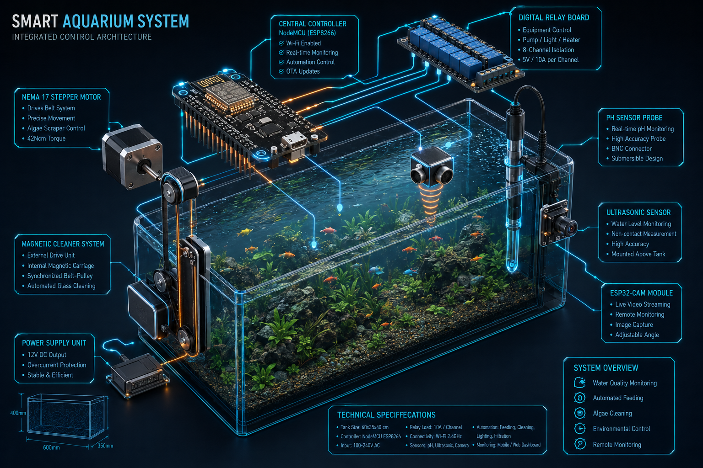

# Smart Aqua Manage and Cleaning Bot


A highly reliable, decentralized, and standalone aquarium management ecosystem powered by local microcontrollers, physical sensors, and a real-time responsive 3D web interface. 

By prioritizing high-reliability local hardware loops over complex cloud networks, this bot ensures zero-latency task execution, maximum safety fail-safes, and a fully automated maintenance schedule—completely free of external dependencies or cloud connectivity.

## Connected Prototype Baseline

The active prototype uses an **ESP32 DevKit** as the main controller and an **ESP32-CAM** as the independent video module. The ESP32 hosts the dependency-free Web UI, WebSocket telemetry, six-hour feeder, filtration safety lockout, turbidity-based water-clarity alert, and the 18:00-06:00 UV schedule. See [`PROTOTYPE.md`](PROTOTYPE.md) and [`firmware/esp32-controller/`](firmware/esp32-controller/) for the current implementation.

The spare NodeMCU and three Arduino Uno boards are not required for the first build. They remain available for later isolation of the CNC gantry or other hardware subsystems.



---

## System Architecture Diagram

The Smart Aqua Manage Bot operates completely offline on a standalone localized loop. The main controllers (NodeMCU and ESP32-CAM) establish a local Wi-Fi access point (AP) or connect to a local router, serving WebSockets and HTTP protocols to host the web dashboard and stream real-time telemetry.

```
                  +-------------------------------------------------+
                  |             Responsive Web Dashboard            |
                  |     (HTML5, Vanilla CSS, Three.js, Vanilla JS)  |
                  +--------+-------------------------------+--------+
                           ^                               ^
                           | HTTP / MJPEG Stream           | WebSockets / HTTP
                           | (Port 80/81)                  | (Port 80/82)
                           v                               v
                +----------+----------+         +----------+----------+
                |  ESP32-CAM Module   |         | ESP32 DevKit Control|
                | (Secondary Stream)  |         |   (Core Controller) |
                +---------------------+         +----------+----------+
                                                           |
      +------------------------+---------------------------+------------------------+------------------------+
      |                        |                           |                        |                        |
      v                        v                           v                        v                        v
+-----+------+           +-----+------+              +-----+------+           +-----+------+           +-----+------+
| Feeder Unit|           |Water/UV Lts|              |Glass Clean |           | Water Level|           | Turbidity  |
| -SG90 Servo|           | -5V Relay  |              | -Stepper   |           | -Capacitive|           |  Sensor    |
| -IR Sensor |           |  (2-Ch)    |              |  -Driver   |           |  Sensor    |           | Analog ADC |
+------------+           +------------+              +------------+           +------------+           +------------+
```

---

## Functional Specification Matrix

### 🥖 1. Feeding & Automation Functions
* **6-Hour Scheduled Feeding Loop:** A local script running on the NodeMCU automatically triggers a physical feeding cycle every 6 hours by driving the SG90 Micro-Servo Motor to release a portion of food.
* **Local Surface Barrier Scan:** Before dropping food, the system scans the surface zone utilizing a KY-032 Infrared (IR) Obstacle Avoidance Sensor module (38kHz modulated) mounted directly below the dispenser.
* **Intelligent Skip Override:** If the IR sensor detects unconsumed floating food remaining on the surface area, the NodeMCU aborts the automated cycle immediately to prevent hazardous overfeeding and organic water decay.
* **Monospace Countdown Telemetry:** Calculates and displays a precise numerical countdown ($hh:mm:ss$) on the web dashboard showing the remaining time until the next automatic feed.
* **Physical Feed Override Button:** A dedicated dashboard switch that triggers the feeding servo immediately, completely bypassing the IR surface sensor check.

### 🎛️ 2. Water Filtration & UV Control Functions
* **Filter Pump Toggle Switch:** Web dashboard commands route to the NodeMCU to engage or cut power to the primary AC water filtration pump by toggling a channel on the 5V Relay Board.
* **UV Sterilizer Toggle Switch:** Independent dashboard command to toggle a second channel on the 5V Relay Board to activate/deactivate the germicidal UV clarifier lamp to control algae spores and clear turbidity.

### 🚨 3. Safety & Monitoring Functions
* **Critical Water Level Monitoring:** Active, continuous tracking of the aquarium's volume via a Capacitive Water Sensor mounted externally or internally on the glass panel.
* **Direct Emergency Routing:** If the water level drops below the designated safe threshold, the NodeMCU immediately overrides the web dashboard timeline, routing real-time warnings directly to the top of the interface.

### 🧼 4. Automated Glass Cleaning Functions
* **Accumulated Run-Time Tracker & Logic:** Logs the cumulative running hours of the UV light and ambient lighting systems, which directly correlate to predicted algae accumulation rates. Every $168\text{ hours}$ (7 days) of total lighting runtime, the system flags the glass panel as degraded or "dirty."
* **Automated Cleaning Cycle Activation:** The NodeMCU automatically drives the Dual High-Torque Stepper Motors (X and Y axes) via the CNC Shield V3, moving a cleaning brush in a 2-axis CNC gantry raster grid pattern (left-right, up-down) across the front pane.
* **Web UI Maintenance Alert:** Pushes an amber status card reading *"Automated Glass Cleaning in Progress"* to the web timeline and applies a green, cloudy texture layer over the 3D tank interface model during active sweeps.
* **Manual Reset & Run Switch:** A dashboard control button to force an instant glass cleaning cycle on demand and reset the accumulated run-time tracker back to zero.

### 🧪 5. Water Quality & Fish Monitoring Functions
* **Water Clarity Monitoring Function:** Captures analog signals from a turbidity sensor, maps calibrated clean and dirty reference samples to a clarity percentage, and sends a security alert when water clarity falls below the configured threshold. This is an operational cleanliness indicator, not a laboratory water-quality test.
* **Fish Movement & Video Monitoring Function:** The independent ESP32-CAM Module hosts a localized HTTP MJPEG video stream broadcasted straight to a Live Preview container frame on the web dashboard for remote physical inspection.

---

## Master Bill of Materials

| Category | Component Name | Description & Quantity |
| :--- | :--- | :--- |
| **🧠 Core Controllers & Power** | **ESP32 DevKit** | Main controller running schedules, safety logic, WebSocket telemetry, and sensor-actuator loops. |
| | **ESP32-CAM Module** | Secondary processing module equipped with an OV2640 camera to stream MJPEG video feed. |
| | **ESP32-CAM Module** | Secondary processing module equipped with an OV2640 camera to stream MJPEG video feed. |
| **🔌 Switching & Motor Drivers** | **5V Relay Board** | Digital low-voltage relay board to isolate and switch high-voltage AC filter pump and UV sterilizer loads. |
| | **CNC Shield V3 (with A4988 Drivers)** | Multi-axis gantry shield to host driver chips, regulating independent step/direction pulses for X and Y stepper motors. |
| **🧲 Actuators & Mechanical** | **SG90 Micro-Servo Motor** | High-precision mini servo to rotate the food-dispensing mechanism during feed cycles. |
| **🧲 Actuators & Mechanical** | **Dual High-Torque Stepper Motors** | NEMA-style stepper motors (Qty: 2) to power the X and Y axes of the CNC cleaning brush gantry. |
| **📡 Sensors & Water Quality** | **KY-032 IR Obstacle Avoidance Sensor** | 38kHz modulated frequency sensor to scan the surface area directly below the dispenser for leftovers. |
| | **Analog Turbidity Sensor** | Optical sensor with signal-conditioning board used to estimate water clarity after calibration with clean and dirty reference samples. |

---

## Web UI Interface & Integration Requirements

Since the frontend is custom-built by the user, the dashboard client must implement the following connections and features to interface with the ESP32 via Firebase:

### 1. Telemetry Displays (Reads from Firebase `/telemetry`)
* **Water Level:** Displays current capacitive sensor depth value (percentage).
* **Water Quality / Clarity:** Displays calibrated turbidity or conductivity values.
* **Feeding Countdown:** Displays a countdown timer showing seconds remaining until the next automatic feed cycle.
* **Status Indicators:** Displays active states of the filtration pump relay, UV light relay, and active gantry cleaning sweep.

### 2. Manual Controls (Writes to Firebase `/commands` or `/settings`)
* **Relay Switches:** Buttons to toggle the filtration pump relay and UV light relay.
* **Manual Feed Trigger:** A button to trigger an instant SG90 feed cycle (bypassing safety checks).
* **Glass Cleaner Trigger:** A button to manually force a 2-axis CNC brush sweep.
* **Scheduled Feed Interval:** A control input to update the hours between automatic feeds, saved in the ESP32's non-volatile memory.

---

## Safety & Maintenance Fail-safe Disclaimers

> [!IMPORTANT]
> **Electrical Safety Standard**
> All high-voltage AC relays, ballasts, and connection blocks MUST be isolated inside a sealed, moisture-proof IP65-rated project enclosure placed completely away from potential water splash zones. Always plug high-voltage aquarium appliances (AC filter pumps and UV ballasts) into Ground Fault Circuit Interrupter (GFCI) outlets.

> [!CAUTION]
> **UV Radiation Exposure**
> Germicidal Ultraviolet light (UV-C) is hazardous to human skin and eyes. Ensure the UV light module is fully shielded inside an opaque filter canister or enclosed chamber. Never operate the UV lamp outside its protective enclosure or look directly at an active bulb.

> [!NOTE]
> **Sensor Calibration & Fail-safe Mode**
> Calibrate the turbidity sensor with known clean and dirty aquarium-water samples before trusting the clarity alert. Low water forces the filtration relay off and sends a critical dashboard/browser notification. The filter remains off after recovery until an operator enables it again.
