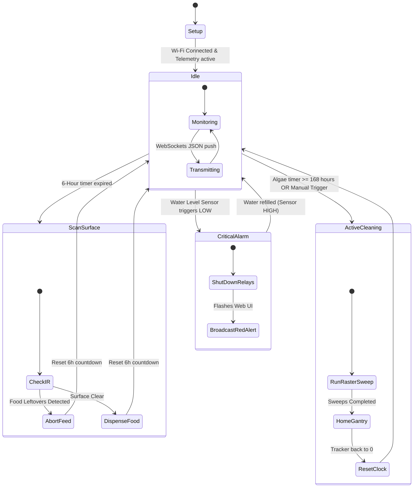

# Smart Aqua Manage Bot (v2.0) - Connectivity & System Guide

This guide provides a detailed conceptual explanation of the physical and network connectivity, the firmware code architecture, the operational project workflows, and visual logic diagrams for the standalone aquarium management system.

---

## 🔌 1. Connectivity & Interfacing Architecture

The system utilizes a dual-microcontroller setup (NodeMCU and ESP32-CAM) communicating over a localized Wi-Fi network. Low-voltage sensors interface directly with the NodeMCU, while high-voltage loads are isolated via optocouplers on the relay board.

```
                                 [LOCAL WI-FI ROUTER]
                                          |
                   +----------------------+----------------------+
                   | (Wi-Fi Client)                              | (Wi-Fi Client)
                   v                                             v
       +-----------------------+                     +-----------------------+
       |   NodeMCU (ESP8266)   |                     |       ESP32-CAM       |
       |  IP: 192.168.1.100    |                     |   IP: 192.168.1.101   |
       +-----------+-----------+                     +-----------+-----------+
                   |                                             |
     [WebSockets]  | (Port 82)                                   | (Port 81) [HTTP Stream]
     Telemetry /   |                                             | Video Frame
     Commands      v                                             v
       +-----------+---------------------------------------------+-----------+
       |                    Responsive Web Dashboard                         |
       |           (Served by NodeMCU Port 80 on local browser)              |
       +---------------------------------------------------------------------+
```

### Physical Wiring & Voltage Isolation
To ensure maximum safety, the system separates logic and load power:
1. **Control Logic (3.3V / 5V DC):** The NodeMCU operates at 3.3V logic. Low-power sensors (Capacitive Water Level, KY-032 IR Obstacle Sensor) are powered by the NodeMCU's 3.3V pin. The SG90 servo, pH-4502C/TDS boards, and A4988 logic run on 5V VCC from the primary DC adapter.
2. **High-Voltage Loads (230V AC):** The AC water filter pump and UV sterilizer ballasts are wired directly to the 5V Relay Board. The relay board has built-in optoisolators (phototransistors) that separate the NodeMCU's digital pins from the inductive back-EMF of the AC lines.
3. **Motor Power (12V / 24V DC):** The NEMA 17 stepper motors run on a dedicated 24V (or 12V) motor power supply ($V_{MOT}$) connected directly to the CNC Shield V3 screw terminals. This prevents heavy inductive motor currents from creating electrical noise on the sensor analog lines.

### Network Port Allocation
* **Port 80 (HTTP Server):** NodeMCU serves the dashboard frontend (`index.html`, `styles.css`, `app.js`).
* **Port 81 (HTTP MJPEG Stream):** ESP32-CAM hosts a local video server, sending continuous JPEG frames to a container frame on the dashboard.
* **Port 82 (WebSocket Server):** NodeMCU hosts a WebSocket connection to stream real-time JSON telemetry to the client and accept instant command payloads.

---

## 📜 2. Firmware Code Logic & Architecture

The firmware runs a non-blocking cooperative multitasking model. Instead of using `delay()`, the microcontroller evaluates delta-time loops using `millis()` to ensure sensors are polled and WebSockets remain responsive.

### A. Main Control Loop (NodeMCU)
The firmware runs three main schedulers:
1. **Fast-Poll Tasks (100ms):** Reads the capacitive water level sensor, checks the IR sensor during active scans, and steps the stepper motors during active cleaning sweeps.
2. **Slow-Poll Tasks (1000ms):** Accumulates lighting run-time clock, decrements the feeding countdown timer, and sends JSON telemetry payloads over WebSockets.
3. **Sensor-Averaging Tasks (2000ms):** Oversamples the Analog A0 pin (10-bit ADC) to calculate a moving average for the TDS water purity level.

### B. Dynamic 2-Axis CNC Cleaning Sweeps (Pseudocode)
When a cleaning sweep is triggered (automatically every 168 hours or via manual override), the NodeMCU executes a raster scan pattern across the front glass. Below is the conceptual code algorithm:

```cpp
// 2-Axis CNC Raster Sweep Algorithm
void runCNCCleaningSweep() {
    float xMin = -3.4, xMax = 3.4;
    float yMin = 0.8,  yMax = 4.2;
    float currentX = xMin;
    float currentY = yMax;
    float yStepInterval = 0.8; // drop down step
    bool movingRight = true;

    // Enable stepper motor drivers
    digitalWrite(CNC_ENABLE_PIN, LOW); 

    while (currentY >= yMin) {
        // 1. Move Horizontally (X-Axis)
        if (movingRight) {
            currentX = moveStepperToPosition(X_AXIS, xMax);
            movingRight = false;
        } else {
            currentX = moveStepperToPosition(X_AXIS, xMin);
            movingRight = true;
        }

        // 2. Drop Vertically (Y-Axis)
        if (currentY > yMin) {
            currentY = moveStepperToPosition(Y_AXIS, currentY - yStepInterval);
        }
    }

    // Home the gantry back to top-left corner
    moveStepperToPosition(Y_AXIS, yMax);
    moveStepperToPosition(X_AXIS, xMin);

    // Disable driver to prevent heat buildup
    digitalWrite(CNC_ENABLE_PIN, HIGH); 
}
```

### C. Analogue TDS Purity Calculation (A0 Pin)
The analog TDS board outputs a voltage between $0\text{V}$ and $2.3\text{V}$. The NodeMCU reads the 10-bit analog pin, applies temperature compensation, and converts it to ppm:

```cpp
float readTDS(float waterTemperatureCelsius) {
    int rawADC = analogRead(A0);
    float voltage = rawADC * (3.3 / 1024.0); // Convert to voltage
    
    // Temperature compensation formula
    float compensationCoefficient = 1.0 + 0.02 * (waterTemperatureCelsius - 25.0);
    float compensatedVoltage = voltage / compensationCoefficient;
    
    // Convert voltage to TDS ppm using characteristic curve
    float tdsValue = (133.3 * pow(compensatedVoltage, 3) 
                     - 255.86 * pow(compensatedVoltage, 2) 
                     + 857.39 * compensatedVoltage) * 0.5;
    
    return tdsValue;
}
```

---

## 🔄 3. Project Operational Workflow

The operational life cycle of the bot is divided into a boot sequence, three active loops, and an emergency interrupt router.

### System Workflow Diagram (Sequence)

```mermaid
sequenceDiagram
    autonumber
    participant D as Web Dashboard
    participant N as NodeMCU (ESP8266)
    participant S as Sensors (TDS, Level, IR)
    participant A as Actuators (Relays, Servo, Steppers)

    Note over N: Power On & AP Boot
    N->>D: Serve index.html, styles.css, app.js (Port 80)
    D->>N: Establish WebSocket Handshake (Port 82)
    
    Loop Every 1 Second (Telemetry Loop)
        N->>S: Poll Water Level & TDS
        S-->>N: Sensor Voltages
        N->>D: Send Telemetry Payload (JSON)
        D->>D: Update 3D Water scale & TDS Gauge
    End

    Loop Every 6 Hours (Feeding Loop)
        N->>S: Trigger KY-032 IR Surface scan
        alt Leftover Food Detected
            S-->>N: LOW (Obstacle Detected)
            N->>D: Send skipped feed warning (Amber alert)
        else Surface Area Clear
            S-->>N: HIGH (Clear)
            N->>A: Spin SG90 servo (dispense portion)
            N->>D: Send successful feed log (Cyan alert)
        end
    End

    rect rgb(40, 20, 20)
        Note over N: Safety Interrupt
        S->>N: Capacitive Water level drops below limit (LOW)
        N->>A: Cut power to UV & Heater relays immediately!
        N->>D: Route RED alert (flashing viewport override)
    End
```


### State Machine Flow


---

## 📐 4. Physical Layout & Component Placement Sketch

Below is a conceptual layout mapping how the hardware is mounted inside and around the glass frame of the aquarium:

```
+---------------------------------------------------------------------------------+
|                                                                                 |
|  [ESP32-CAM]                                                   [Food Dispenser] |
|  (Rim Mounted)                                                 (SG90 Servo)     |
|       |                                                             |           |
|       v                                                             v           |
|  +-----------------------------------------------------------------------+      |
|  | . . . . . . . . . . . . . . . . . . . . . . . . . . . . . . . . . . . |      |
|  |==============================[ Top Rail ]=============================|      |
|  |                                  |                                    |      |
|  |                                  |                                    |      |
|  |                                  | <--- [Vertical CNC Rail]           |      |
|  |                                  |                                    |      |
|  |                       +----------+----------+                         |      |
|  |                       |  [Cleaning Brush]   |                         |      |
|  |                       |  (X-Y Motor Driven) |                         |      |
|  |                       +----------+----------+                         |      |
|  |                                  |                                    |      |
|  |                                  |                                    |      |
|  |============================[ Bottom Rail ]============================|      |
|  |                                  |                                    |      |
|  +-----------------------------------------------------------------------+      |
|    |                                                                            |
|    v [Inside Tank]                                                              |
|   - [TDS Probe] (Submersed)                                                     |
|   - [Capacitive Sensor] (Stuck externally to glass)                             |
|   - [Filter & UV Chamber] (Back corner)                                         |
|                                                                                 |
|    +-----------------------------+                                              |
|    |    [Control Box Enclosure]  |                                              |
|    |  - NodeMCU                  |                                              |
|    |  - CNC Shield V3 + A4988s   |                                              |
|    |  - 5V Relay Board           |                                              |
|    +-----------------------------+                                              |
+---------------------------------------------------------------------------------+
```
