# Global Connectivity Plan: Vercel Hosting & Firebase Realtime Database

This document details the architectural plan for global access monitoring and control of the Smart Aqua Manage Bot utilizing **Vercel** for hosting the frontend web application and **Google Firebase Realtime Database** as the real-time cloud sync bridge.

---

## 1. System Architecture: Vercel & Firebase Sync

To provide secure, low-latency control from anywhere in the world, the system is structured as a cloud-synchronized loop:

```
                                  +------------------------------+
                                  |       Vercel Server          |
                                  |  (Hosts 3D Web Dashboard)    |
                                  |   https://smartaqua.vercel.app|
                                  +--------------+---------------+
                                                 |
                                                 | Reads/Writes (JSON API)
                                                 v
+-----------------------+         +--------------+---------------+
|   ESP Microcontroller |<=======>|  Google Firebase Realtime DB |
|  (Connected to Home   |         |      (Cloud Database Sync)   |
|   Wi-Fi Internet)     |         |  https://project.firebaseio  |
+-----------------------+         +------------------------------+
```

### Components
1. **Frontend Hosting (Vercel):** The responsive Web Dashboard (`web/` folder) is deployed to Vercel. Vercel provides a globally distributed CDN, automatic SSL certificates (HTTPS), and zero-configuration builds.
2. **Cloud Database (Firebase Realtime Database):** A NoSQL cloud database hosted by Google. It synchronizes data in real-time to all connected clients using WebSocket-based streams.
3. **Hardware Node (ESP32/ESP8266):** The controller connects to your home Wi-Fi and exchanges data with Firebase using secure SSL HTTP/WebSockets.

---

## 2. Communication Protocol & Workflows

Instead of directly hosting web servers on the ESP (which requires complex router port-forwarding and exposing your home network to the public internet), the ESP and Vercel communicate through Firebase.

### A. Telemetry Stream (ESP ➔ Firebase ➔ Vercel)
* **ESP Action:** Every 2 to 3 seconds, the ESP polls the sensors (TDS, water level) and writes a JSON payload to the `/telemetry` path in Firebase using the `Firebase-ESP-Client` C++ library.
* **Vercel Dashboard Action:** The dashboard running in the browser attaches a listener to the `/telemetry` path in Firebase. Firebase instantly pushes any changes to the browser, updating the live telemetry values and status gauges in real-time.

### B. Command Routing (Vercel ➔ Firebase ➔ ESP)
* **Vercel Dashboard Action:** When you toggle a button (e.g., "FEED NOW"), the dashboard writes the new command state (e.g. `{"feed_now": true}`) to the `/commands` path in Firebase.
* **ESP Action:** The ESP keeps an active stream listener connected to the `/commands` path. As soon as Firebase detects the write, it sends a stream event to the ESP over the Wi-Fi. The ESP parses the command, executes the physical motor/relay logic, and writes `{"feed_now": false}` back to Firebase to clear the trigger state.

---

## 3. Database Schema

The database is structured as a single JSON tree:

```json
{
  "aquarium": {
    "telemetry": {
      "tds": 150,
      "waterLevel": 95,
      "filterActive": true,
      "uvActive": false,
      "nextFeedSeconds": 21599,
      "algaeClock": 42.5,
      "timestamp": 1783683522
    },
    "commands": {
      "feedOverride": false,
      "filterToggle": true,
      "uvToggle": false,
      "cleanSweep": false
    }
  }
}
```

---

## 4. Connection & Synchronization Sequence

```mermaid
sequenceDiagram
    autonumber
    actor User
    participant Browser as Vercel Frontend
    participant DB as Firebase Database
    participant ESP as ESP Microcontroller
    participant Hard as Physical Sensors/Actuators

    ESP->>DB: Establish persistent SSL connection (Port 443)
    ESP->>DB: Listen to path: "/aquarium/commands"
    Browser->>DB: Listen to path: "/aquarium/telemetry"

    rect rgb(20, 30, 40)
        Note over ESP: Telemetry Loop (Every 3 seconds)
        Hard->>ESP: Poll TDS & Water Level
        ESP->>DB: Update "/aquarium/telemetry" (JSON write)
        DB-->>Browser: Event: Telemetry Updated
        Browser->>Browser: Update Status Gauges & Text
    end

    rect rgb(40, 30, 20)
        Note over Browser: Command Loop
        User->>Browser: Clicks "FEED NOW"
        Browser->>DB: Set "/aquarium/commands/feedOverride" = true
        DB-->>ESP: Event: command changed
        ESP->>Hard: Spin SG90 Servo (feed fish)
        ESP->>DB: Reset "/aquarium/commands/feedOverride" = false
        DB-->>Browser: Event: command reset to false (UI button returns to idle)
    end
```



---

## 5. Deployment & Integration Checklist

### A. Vercel Deployment Setup
1. **GitHub Sync:** Connect your GitHub repository to your Vercel account.
2. **Project Root:** Configure Vercel to use the folder containing your custom Web UI assets (e.g. your dashboard root directory) as the project root directory.
3. **Environment Variables:** Define your Firebase API key and database URL as Vercel environment variables:
   * `NEXT_PUBLIC_FIREBASE_API_KEY`
   * `NEXT_PUBLIC_FIREBASE_DATABASE_URL`

### B. ESP Firmware Configuration
1. **Libraries:** Install `Firebase-ESP-Client` via Arduino Library Manager.
2. **SSL Certificates:** Include root certificate authority fingerprints for Firebase (`*.firebaseio.com`) to allow HTTPS handshakes.
3. **Token Auth:** Secure the database connection using Firebase Database Secret tokens or Email/Password credentials.
