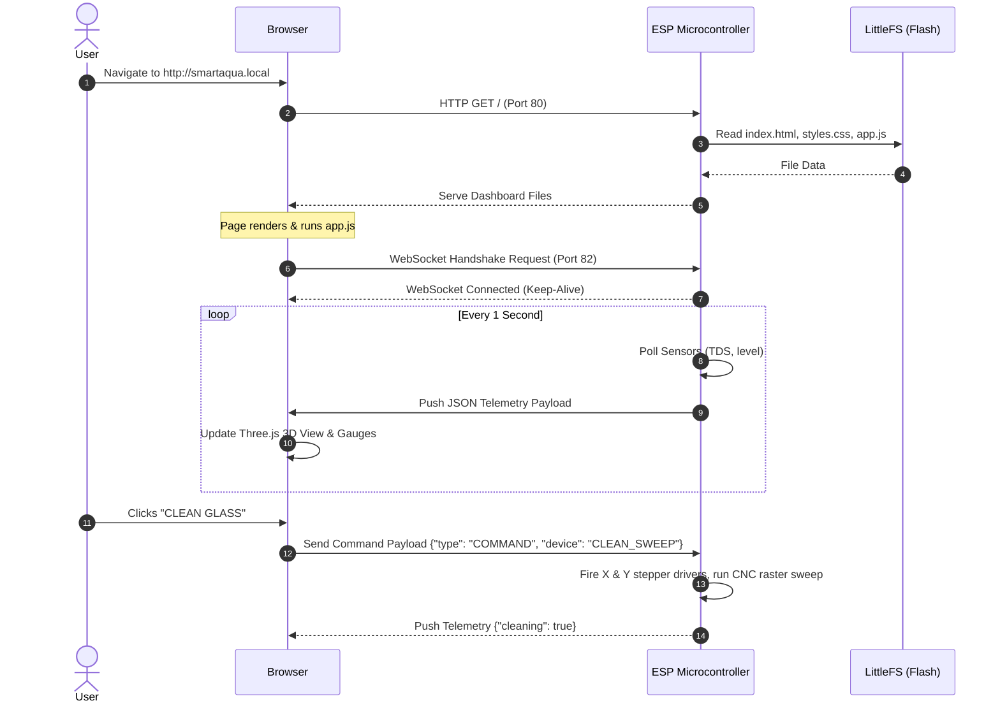

# Communication & Telemetry Plan: Web-to-ESP Local Connectivity

This document outlines the architectural plan for connecting the Web Dashboard client to the local ESP microcontroller (ESP32/ESP8266) without relying on external cloud networks or heavy database servers.

---

## 1. Core Architecture: Localized Zero-Latency Loop

To maintain the system's requirement of **high reliability and offline independence**, we will bypass cloud databases (like Firebase, AWS, or MySQL) and external hosting. Instead, the communication stack is hosted entirely on the microcontroller itself using the local Wi-Fi router.

```
+-------------------------------------------------------------------------+
|                          LOCAL WI-FI NETWORK                            |
|                                                                         |
|  +------------------------+                     +-----------------------+
|  |   Microcontroller      |  Serves Web Files   |    Web Client Browser |
|  |  (ESP32 / ESP8266)     |-------------------> | (PC/Tablet/Smartphone)|
|  |  - IP: 192.168.4.1     |   (Port 80 HTTP)    |                       |
|  |  - Host: smartaqua.loc |                     +-----------+-----------+
|  +-----------+------------+                                 |
|              ^                                              |
|              |         WebSocket Bi-directional Stream      |
|              +==============================================+
|                            (Port 82 WS - Real-time)                     |
+-------------------------------------------------------------------------+
```

---

## 2. Communication Methods & Protocols

We will implement three core local network technologies:

### A. HTTP Web Server (Port 80) — File Delivery
* **How it works:** The ESP runs a lightweight HTTP web server. The HTML, CSS, and JS dashboard files are stored directly on the ESP's onboard flash memory filesystem (**LittleFS**).
* **Action:** When you connect your phone or laptop to the smart aquarium's local Wi-Fi and type the IP address in your browser, the ESP reads the web files from flash memory and sends them to your browser.
* **Why this is used:** It removes the need for hosting the website on the internet. The dashboard is loaded straight from the physical hardware.

### B. WebSockets (Port 82) — Real-Time Telemetry & Commands
* **How it works:** Unlike HTTP requests (which require opening and closing a connection for every single query), WebSockets establish a single, persistent, bi-directional connection between the web browser and the ESP.
* **Telemetry Flow (ESP -> Web):** Every 1 second, the ESP gathers sensor readings (TDS, water level, countdown, active cycles) and pushes them as a lightweight JSON string to the browser.
* **Command Flow (Web -> ESP):** When you toggle a button on the dashboard (e.g., turn UV light ON), a WebSocket message is instantly sent to the ESP, triggering the relay in milliseconds.
* **Why this is used:** Zero latency, extremely low overhead, and real-time updates.

### C. mDNS (Multicast DNS) — Name Resolution
* **How it works:** Instead of memorizing and typing numeric IP addresses like `192.168.4.1` into your browser, the ESP broadcasts a local domain name using mDNS.
* **Action:** You can simply type `http://smartaqua.local` in your browser address bar, and your device will automatically locate the ESP.

---

## 3. Data Persistence: Do We Need a Database?

**No, a standard database is not required.** A full database (like SQLite or MySQL) consumes too much RAM and flash space on a microcontroller. 

Instead, we will use the following local storage methods:

1. **Onboard Flash Memory Configuration (LittleFS):** 
   * Settings (such as SSID, passwords, and custom feeding intervals) will be stored in a simple, flat JSON configuration file (`config.json`) inside the ESP's LittleFS flash storage.
2. **Non-Volatile RAM (EEPROM/Preferences):**
   * High-write data (like the cumulative `algaeClock` run-time hours) will be saved in the EEPROM (ESP8266) or via the **Preferences Library** (ESP32) so that if the power cuts out, the gantry runtime tracker is not lost and resumes exactly where it left off.
3. **Circular Logger Buffer (In-RAM):**
   * The status timeline logs (Cyan, Amber, Red cards) will be generated dynamically by the ESP and pushed to the browser. The web app's memory will keep the last 20 logs active. We do not need to store years of log history on the micro-chip.

---

## 4. WebSocket Data Payloads (JSON Schema)

### A. Telemetry Stream (ESP -> Browser)
Sent automatically every second to update the 3D model, pH/TDS gauges, and status cards.

```json
{
  "type": "TELEMETRY",
  "tds": 155,
  "waterLevel": 95,
  "filterActive": true,
  "uvActive": false,
  "nextFeed": 21599,
  "algaeHours": 42.5,
  "cleaning": false
}
```

### B. Control Commands (Browser -> ESP)
Sent immediately when a dashboard switch is clicked.

```json
{
  "type": "COMMAND",
  "device": "FILTER" | "UV" | "FEED_OVERRIDE" | "CLEAN_SWEEP",
  "state": true | false
}
```

---

## 5. Connection Sequence Workflow


